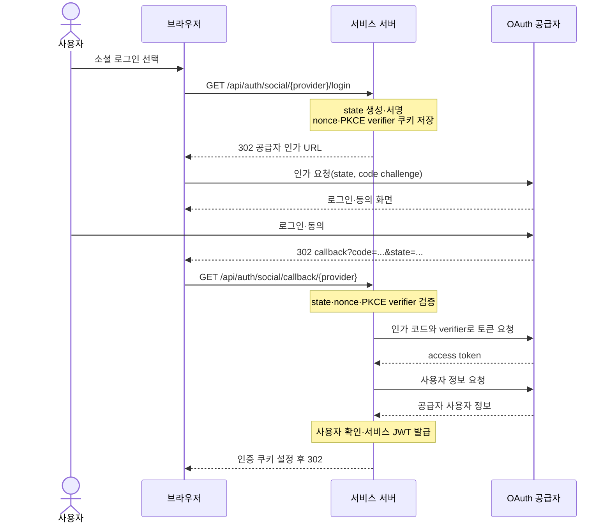

# Social OAuth 로그인 흐름

## 공통 흐름

OAuth 공급자는 브라우저에 `302` 응답을 보내고, 브라우저가 서비스 callback
주소로 이동합니다. 공급자가 서비스 서버를 직접 호출하는 흐름이 아닙니다.
토큰 요청은 세 공급자 모두 `POST` form body를 사용하며 `Client Secret`과 PKCE
verifier를 request URI에 넣지 않습니다.

## 공급자별 엔드포인트

| 공급자 | 인가 엔드포인트                                | 토큰 엔드포인트                       | 사용자 정보 엔드포인트                             |
| ------ | ---------------------------------------------- | ------------------------------------- | -------------------------------------------------- |
| Google | `https://accounts.google.com/o/oauth2/v2/auth` | `https://oauth2.googleapis.com/token` | `https://openidconnect.googleapis.com/v1/userinfo` |
| Kakao  | `https://kauth.kakao.com/oauth/authorize`      | `https://kauth.kakao.com/oauth/token` | `https://kapi.kakao.com/v2/user/me`                |
| Naver  | `https://nid.naver.com/oauth2/authorize`       | `https://nid.naver.com/oauth2/token`  | `https://openapi.naver.com/v1/nid/me`              |

## 코드 매핑

| 단계                          | 파일                                                | 역할                                            |
| ----------------------------- | --------------------------------------------------- | ----------------------------------------------- |
| 로그인 URL 생성·callback 처리 | `backend/src/controllers/auth/social.controller.js` | 공급자 URL 생성, state·PKCE 검증, 최종 리디렉션 |
| state·PKCE 생성·검증          | `backend/src/providers/oauth-state.provider.js`     | HMAC·만료·nonce·verifier·이동 경로 검증         |
| 임시 transaction·인증 쿠키    | `backend/src/providers/cookie.provider.js`          | nonce·PKCE verifier·인증 쿠키 설정·삭제         |
| 토큰 교환·프로필 정규화       | `backend/src/services/social-auth.service.js`       | 공급자 API 호출과 사용자 처리                   |
| 사용자 조회·생성              | `backend/src/repository/user.repository.js`         | 소셜 식별자와 사용자 데이터 접근                |
| 서비스 JWT                    | `backend/src/providers/token.provider.js`           | Access Token·Refresh Token 발급                 |

## 사용자 처리 경계

1. 같은 `provider + providerId`로 연결된 사용자가 있으면 해당 사용자를
   반환합니다.
2. 연결된 사용자가 없고 공급자가 검증한 이메일과 같은 기존 계정이 있으면
   자동 연결하지 않고 명시적인 계정 연결을 요구합니다.
3. 새 사용자라면 소셜 계정과 함께 생성합니다. 검증되지 않았거나 식별용으로
   부적절한 연락처 이메일은 `provider:providerId`의 SHA-256 digest를 Base64URL로
   인코딩해 만든 내부 가상 주소로 대체합니다.
